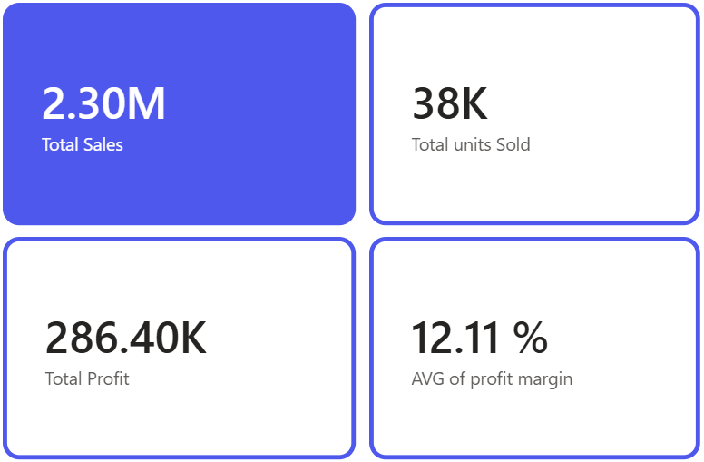
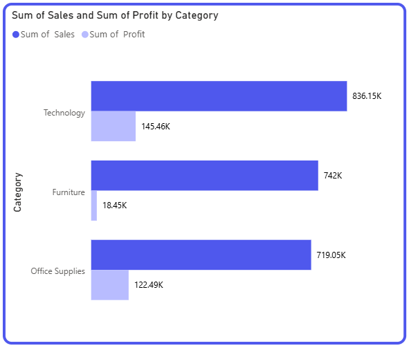
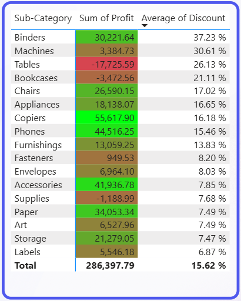
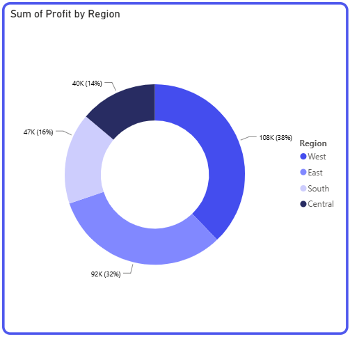
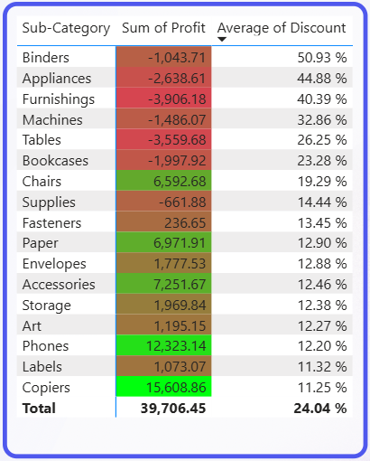

# Superstore Sales & Profitability Analysis

##  Project Overview & Business Objective
This project analyzes a dataset of a storefront's sales ($2.3M) to identify inefficiencies in profitability. The primary objective is to investigate why certain categories generate high sales volume but fail to deliver expected net profit, and to provide data-driven recommendations to optimize pricing, logistical costs, and discounting strategies.

**Data Source:** Superstore Sales Dataset (Kaggle)

**Dataset Size:** 9,994 transactional rows

---

##  Tech Stack & Tools Used
**Microsoft Excel / Power Query:** Used for initial data profiling, handling missing values, and data type standardization.

**Power BI Desktop:** Used for advanced data modeling and interactive dashboard design.

---

##  Data Preparation & Cleaning
Before building the dashboard, a rigorous data cleaning process was executed to ensure data quality and accurate reporting:
**Missing Values:** Identified and handled missing entries in critical transactional columns to prevent calculation gaps.

**Data Type Standardization:** Formatted Date columns (Order Date, Ship Date) into standard date formats and ensured financial columns (Sales, Profit, Discount) were typed as precise decimals/currencies.

**Duplicate Audit:** Scanned and removed duplicate rows to maintain a clean transactional baseline.

**Data Transformation:** Extracted and created customized calculated columns to facilitate deeper regional and category slicing.

> 📁 *Note: The raw data can be found in `01_Superstore_Raw_Data.xlsx` and the cleaned version in `02_Superstore_Cleaned_Data.xlsx` within this repository.*

---

## Executive Summary & Key Performance Indicators (KPIs)

| Business Context & Key Metrics | Executive Financial KPIs |
| :--- | :---: |
| **Executive Overview:**  This dashboard evaluates the operational and financial performance of a $2.3M Superstore dataset. It is designed to track net profitability, identify cost leaks, and highlight areas where operational efficiency can be improved.  **Strategic KPI Insights:**  **Sales vs. Profits:** The business achieved **$2.30M in Total Sales** with **38K units sold**, which generated **$286.40K in Total Profit**.  **The Margin Challenge:** The overall **Profit Margin is 12.11%**. This shows that while sales volume is high, profit margins are being compressed, indicating a clear need to optimize discounting strategies and logistical costs. |  |

## Sales vs Profit Performance by Category

| Category Analysis | Sales & Profit Overview |
| :--- | :---: |
| **The Furniture Profit Gap:**  An analysis of the primary product categories reveals a clear gap between sales volume and actual profitability. While **Furniture** generated **$742K in Sales**—which is almost equal to Office Supplies ($719K)—its net profit was only **$18.45K** compared to **$122.49K** for Office Supplies.  **Key Takeaway:**  This means Furniture brought in high revenue but failed to convert it into profits, resulting in a significantly lower net return.   *In the next section, we will look closely at the sub-categories to find out exactly why Furniture is losing its profit margin, focusing on the impact of discounts.* |  |
## Sub Category Profitability & Discount Matrix

| Discount vs. Profit Leak Insights | Sub-Category Matrix Visual |
| :--- | :---: |
| **Why This Matrix Matters:**  This matrix provides a clear, high-level overview of performance by mapping the direct relationship between **Average Discount** percentages and **Sum of Profit** across all sub-categories. The color coding allows management to instantly spot profit leaks and pricing inefficiencies.  **The Major Profit Leaks:**  **Tables:** Tables stand out as the most critical financial drain, suffering a severe net loss of **-$17,725.59**. This loss is driven by a high average discount rate of **26.13%**, which completely destroyed the product's margin.  **Bookcases:** Similarly, Bookcases show a secondary profit deficit, hitting a negative return of **-$3,472.56** due to an aggressive **21.11%** discount rate.  **Full Portfolio Overview:**  Beyond these specific losses, you can review the entire matrix to compare high-performing items (like Binders and Copiers) against discounted products, providing a comprehensive audit of the company's discounting strategy. |  |
##  Regional Profit Contribution Overview

| Regional Profit Distribution Analysis | Sum of Profit by Region Visual |
| :--- | :---: |
| **Geographic Profit Overview:**  This chart provides a high-level view of how net profit is distributed across the four primary operational regions. While the **West** leads performance at **$108K (38%)**, followed closely by the **East** at **$92K (32%)**, there is a noticeable drop in the remaining territories.  **The Underperforming Region:**  The data highlights that the **Central Region** is the lowest-performing zone, contributing only **$40K (14%)** to the total profit baseline.   *In the next section, we will deep dive into the Central Region's specific metrics to uncover the primary root cause behind this underperformance specifically focusing on the impact of aggressive promotional discounting.* |  |
## Central Region Deep Dive & Margin Analysis

| Central Region Discount Paradox | Sub-Category Regional Filter Visual |
| :--- | :---: |
| **The Regional Discount Paradox:**  Filtering the data specifically for the **Central Region** reveals a critical operational breakdown. Products that are highly profitable on a national level suddenly turn into heavy losses here due to extreme, un-optimized promotional discounting.  **The Margin Erosion Breakdown:**  **Binders:** Average discounts skyrocketed to **50.93%**, shifting a normally profitable item into a net loss of **-$1,043.71**.  **Appliances:** Average discounts reached **44.88%**, driving profits down to **-$2,638.61**.  **Furnishings:** Average discounts hit **40.39%**, resulting in a **-$3,906.18** deficit.   *This severe margin compression across multiple stable categories indicates an immediate need for localized pricing corrections and structural changes, which are detailed in the final recommendations section below.* |  |
---

##  Strategic Recommendations for Management

Based on the data insights and profit leaks identified across sub-categories and territories, the following actions are recommended to optimize business profitability:

 **Enforce Table Discount Control:** Immediately reduce the aggressive average discount rate on **Tables**. It is recommended to implement a strict discount cap or re-evaluate the baseline pricing structure to halt this primary financial drain.
 
 **Correct Bookcases & Supplies Pricing:** Apply similar discount corrections to **Bookcases** and **Supplies** within underperforming segments. Lowering these promotional rates is vital to pulling these sub categories out of their net deficit.
 
 **Standardize Central Region Discount Policies:** Address the root cause of underperformance in the **Central Region**. The data proves its low profitability is driven by extreme discounting policies that radically deviate from other successful regions. You must lower and standardize these regional promotional rates to align with national baselines.
